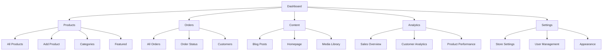

# Diva & Dons Dashboard Architecture

## Project Overview
E-commerce platform for Diva & Don company - a business that sells dresses and cosmetics. **Current State**: All content is hardcoded and static - no database, no dynamic content, no backend functionality. The dashboard will need to create the entire data infrastructure from scratch.

## Dashboard Structure

### Main Navigation


## Section Details

### 1. Products Management
**Purpose**: Complete product lifecycle management for dresses and cosmetics

**Features**:
- **All Products**: Grid/list view with filters (category, price, status)
- **Add Product**: Form with image upload, variants, pricing
- **Featured Products**: Control homepage featured items

**Data Model**:
```typescript
interface Product {
  id: string;
  name: string;
  category: string;
  subcategory?: string;
  price: number;
  description: string;
  images: string[];
  variants: ProductVariant[];
  featured: boolean;
  status: 'active' | 'inactive' | 'out_of_stock';
  createdAt: Date;
  updatedAt: Date;
}

interface ProductVariant {
  id: string;
  sku: string;
  size: string;
  color: string;
  stock: number;
  price: number;
}
```

### 2. Orders Management
**Purpose**: Order processing and customer management

**Features**:
- **All Orders**: View order details, status, customer info
- **Order Status**: Update processing, shipped, delivered
- **Customers**: Manage customer profiles and order history

**Data Model**:
```typescript
interface Order {
  id: string;
  customer: Customer;
  items: OrderItem[];
  total: number;
  status: 'pending' | 'processing' | 'shipped' | 'delivered' | 'cancelled';
  shippingAddress: Address;
  billingAddress: Address;
  paymentMethod: string;
  createdAt: Date;
  updatedAt: Date;
}

interface Customer {
  id: string;
  name: string;
  email: string;
  phone: string;
  addresses: Address[];
  orders: Order[];
}
```

### 3. Content Management
**Purpose**: Manage blog posts, homepage content, and media

**Features**:
- **Blog Posts**: Create, edit, publish blog content
- **Homepage**: Manage hero sections, collections, testimonials
- **Media Library**: Upload and organize images

**Content Types**:
- Blog posts with categories (Fashion, Beauty)
- Homepage sections (Hero, Collections, Testimonials)
- Image galleries and banners

### 4. Analytics & Reports
**Purpose**: Data-driven insights for business decisions

**Features**:
- **Sales Overview**: Revenue, conversion rates, top products
- **Customer Analytics**: Demographics, behavior, retention
- **Product Performance**: Best sellers, inventory levels

**Metrics Dashboard**:
- Total sales and revenue
- Conversion rate
- Average order value
- Top performing products
- Customer acquisition channels

### 5. Settings & Configuration
**Purpose**: Store configuration and user management

**Features**:
- **Store Settings**: General settings, shipping, payment methods
- **User Management**: Admin roles, permissions
- **Appearance**: Theme customization, branding

**Configuration Options**:
- Store name, logo, contact information
- Shipping methods and rates
- Payment gateway settings
- Email notifications
- Role-based permissions

## Technical Architecture

### Frontend Stack
- **Framework**: Next.js 16.1.6 with React 19.2.3
- **Styling**: Tailwind CSS with existing design system
- **State Management**: Context API or Redux
- **Routing**: Protected routes for admin functionality
- **UI Components**: Reusable dashboard components

### Backend Integration
- **API**: RESTful API endpoints for all operations
- **Database**: PostgreSQL or MongoDB for product/order data
- **Authentication**: JWT tokens with role-based access
- **File Storage**: Cloud storage for product images

### Security Features
- **Authentication**: Secure admin login with session management
- **Authorization**: Role-based access control (RBAC)
- **Validation**: Server-side and client-side input validation
- **CSRF Protection**: Cross-site request forgery protection

## Implementation Phases

### Phase 1: Foundation Infrastructure
1. **Database Setup**: Create PostgreSQL/MongoDB schema for all data
2. **API Foundation**: Build RESTful API endpoints from scratch
3. **Authentication System**: Admin login and session management
4. **Data Migration**: Import hardcoded data into database structure
5. **Basic Product Management**: CRUD operations for products
6. **Dashboard Layout**: Main navigation and page structure

### Phase 2: Advanced Features
1. **Order Processing**: Update order status, fulfillment
2. **Content Management**: Blog posts and homepage content
3. **Analytics Dashboard**: Basic sales and product metrics
4. **User Management**: Admin roles and permissions

### Phase 3: Enhanced Functionality
1. **Advanced Analytics**: Customer insights, product performance
2. **Media Library**: Image upload and organization
3. **Bulk Operations**: Update multiple products/orders
4. **Notifications**: Real-time alerts for new orders

## UI/UX Design Guidelines

### Design System
- **Colors**: Consistent with existing brand (amber, stone, neutral tones)
- **Typography**: Libre Baskerville for headings, DM Sans for body
- **Components**: Reusable dashboard components following existing patterns
- **Responsive**: Mobile-first design with desktop optimization

### User Experience
- **Navigation**: Clear sidebar with active state indication
- **Data Tables**: Sortable, searchable, with pagination
- **Forms**: Consistent validation and error handling
- **Feedback**: Loading states, success/error messages
- **Accessibility**: WCAG 2.1 AA compliance

## Performance Considerations

### Optimization Strategies
- **Lazy Loading**: Dashboard components and data
- **Caching**: API responses and frequently accessed data
- **Image Optimization**: Responsive images with proper sizing
- **Code Splitting**: Separate admin bundle from public site

### Scalability
- **Database Indexing**: Optimize query performance
- **API Rate Limiting**: Prevent abuse and ensure stability
- **CDN Integration**: Static asset delivery
- **Monitoring**: Performance metrics and error tracking

## Testing Strategy

### Quality Assurance
- **Unit Tests**: Component and utility function testing
- **Integration Tests**: API endpoint and database operations
- **E2E Tests**: Complete user workflows
- **Performance Tests**: Load testing and optimization

### Security Testing
- **Penetration Testing**: Vulnerability assessment
- **Authentication Testing**: Session management and access control
- **Data Validation**: Input sanitization and validation
- **Compliance**: GDPR and data protection requirements

---

*This document serves as the foundation for implementing a comprehensive admin dashboard for the Diva & Dons e-commerce platform.*